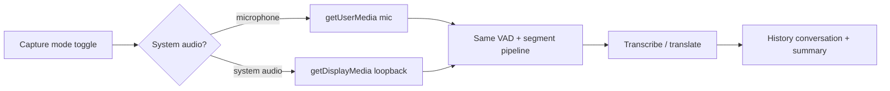

# 线上会议记录 (Online Meeting Recording)

Capture **system speaker output** (not the microphone) as the transcription source, so users can record and transcribe online meetings without holding a mic up to the speaker.

## How it fits the existing app

The whole transcription pipeline already runs off a single `getUserMedia()` call inside `contexts/transcription-context.tsx`, wrapped by a desktop override (`installDesktopAudioInputOverride`) that swaps in the user's preferred device and attaches metering + a `MediaRecorder` per segment. Everything downstream (VAD segmentation, transcription, translation, history, summaries) is source-agnostic.

So we do **not** rebuild the pipeline. We add a **capture mode** ("microphone" vs "system audio") and, when system audio is selected on the Electron desktop build, route capture through `getDisplayMedia({ audio: ... })` instead of `getUserMedia`. The captured loopback stream flows into the exact same segmentation/transcription path and produces the same `TranscriptionMessage[]` + history conversation.

Why desktop-only: real system-audio loopback requires Electron's `session.setDisplayMediaRequestHandler` with `audio: 'loopback'` (confirmed in Electron 39 docs via Context7). Mobile OSes don't allow capturing arbitrary system output, so the feature is gated to the Electron desktop target (consistent with the existing "Desktop input" card that is already `isDesktopApp`-gated).



## Changes

### 1. Electron main — grant loopback audio
`electron/main.js`
- In `app.whenReady`, after `configurePermissions()`, register a display-media handler on `session.defaultSession`:
  ```js
  session.defaultSession.setDisplayMediaRequestHandler((request, callback) => {
    desktopCapturer.getSources({ types: ['screen'] }).then((sources) => {
      callback({ video: sources[0], audio: 'loopback' });
    }).catch(() => callback({}));
  });
  ```
  (Import `desktopCapturer` from `electron`.) This makes `navigator.mediaDevices.getDisplayMedia()` in the renderer return a stream whose audio track is the system loopback. We request a `screen` video source because Chromium requires a video source to attach loopback audio; the video track is stopped immediately in the renderer and never used.
- Extend the existing permission handlers so display-media / screen requests from the trusted origin are allowed (they currently only pass `media`/`microphone`).

### 2. Settings model — capture mode
`types/settings.ts`
- Add `audioCaptureMode: 'microphone' | 'system'` to `AppSettings` (default `'microphone'`, so existing behavior is unchanged).
- Add the default to `defaultSettings`.

`contexts/settings-context.tsx` persists via the existing merge/migration path, so a missing key falls back to the default automatically — verify the load merge covers new keys (it spreads over `defaultSettings`).

### 3. Capture routing — the core change
`contexts/transcription-context.tsx`
- Add module-level `preferredCaptureMode: 'microphone' | 'system'` plus `updatePreferredCaptureMode()`, mirroring the existing `preferredDesktopAudioInputId` pattern.
- In the `getUserMedia` override (`installDesktopAudioInputOverride`), when `preferredCaptureMode === 'system'` and `isElectronDesktop`:
  - Call `navigator.mediaDevices.getDisplayMedia({ video: true, audio: { ...desktop-friendly constraints, autoGainControl:false, echoCancellation:false, noiseSuppression:false } })`.
  - Immediately stop the returned **video** track, keep only the audio track, and return a new `MediaStream([audioTrack])`.
  - Reuse `attachDesktopMeteringStream(stream)` so the live level meter works exactly as today.
  - If `getDisplayMedia` fails or returns no audio track, surface a clear error and fall back to mic.
- In the settings sync `useEffect` (currently syncing `desktopAudioInputId`), also call `updatePreferredCaptureMode(settings.audioCaptureMode)`.
- Segment recording uses `resolveDesktopRecordingStream()` / `MediaRecorder`, which already operate on whatever stream the override returned — no change needed there.

### 4. UI — entry point + toggle
- **Recording settings** (`app/(tabs)/settings/recording.tsx`): inside the existing desktop-only "Desktop input" `AppCard`, add a capture-mode switch ("Microphone" / "System audio") using HeroUI Native `Switch` or two `OptionPill`s (matching the existing pill pattern). When "System audio" is active, the device picker + mic test are hidden/disabled (they apply to mic capture only) and a short helper line explains loopback capture. Wire to `updateSettings({ audioCaptureMode })`.
- **Recording toggle** (`components/recording-toggle.tsx`): when capture mode is `system`, show the meeting/speaker icon (e.g. `volume-high` or `display`) and the accessibility label/`full` label reflects "线上会议记录". This makes the active mode obvious on the live capture screen without adding a separate screen.
- No new tab/route is required — it reuses the existing live-capture surface. Per the confirmed decision, the switch lives only in Recording settings; no separate quick-start button is added.

### 5. i18n
Add keys to all 6 locale files (`en`, `es`, `ja`, `ko`, `zh-Hans`, `zh-Hant`) under `settings.recording.input` and a new `transcription` label, e.g.:
- `settings.recording.capture.title` = "Audio source" / 录制声源
- `settings.recording.capture.microphone` = "Microphone" / 麦克风
- `settings.recording.capture.system` = "System audio (meeting)" / 系统声音（会议）
- `settings.recording.capture.system_hint` = explanation that it records speaker output for online meetings
- `transcription.controls.meeting` / accessibility label for the meeting mode
`zh-Hans` gets the canonical "线上会议记录" string. Run `bun run check:i18n` to confirm parity.

## Constraints honored
- **Electron/RN parity:** mobile keeps microphone capture; the system-audio toggle only renders on the desktop build (`isDesktopApp`), so RN screens stay valid. Default `microphone` means zero behavior change on mobile.
- **HeroUI Native + Uniwind tokens** for any new controls; reuse `OptionPill` / settings components per AGENTS.md. Will fetch HeroUI `Switch` docs before implementing if a Switch is used.
- **Privacy:** loopback capture is user-initiated and gated behind the OS screen-recording permission (macOS prompts automatically via `getDisplayMedia`). No new persisted audio beyond existing transient segment files.

## Verification
- `bun run lint`
- `bunx tsc --noEmit --pretty false`
- `bun run check:i18n`
- `git diff --check`
- Manual desktop smoke test: build desktop (`bun run desktop:build` + run Electron), switch to System audio, play meeting/video audio, confirm transcript segments appear and the level meter responds. Confirm mic mode still works and mobile is unaffected.

## Confirmed decisions
1. **macOS permission:** rely on the native screen-recording permission prompt triggered by the first `getDisplayMedia` loopback call. No in-app explainer screen before it; we only surface a clear error message if the user denies.
2. **UI placement:** capture-mode switch lives **only** in the Recording settings card. The recording toggle button still reflects the active mode (icon/label), but there is no separate quick-start entry on the transcription screen.
3. **Audible playback:** use plain `audio: 'loopback'` so meeting audio keeps playing through the speakers during capture (no muting). `loopbackWithMute` is not used.
