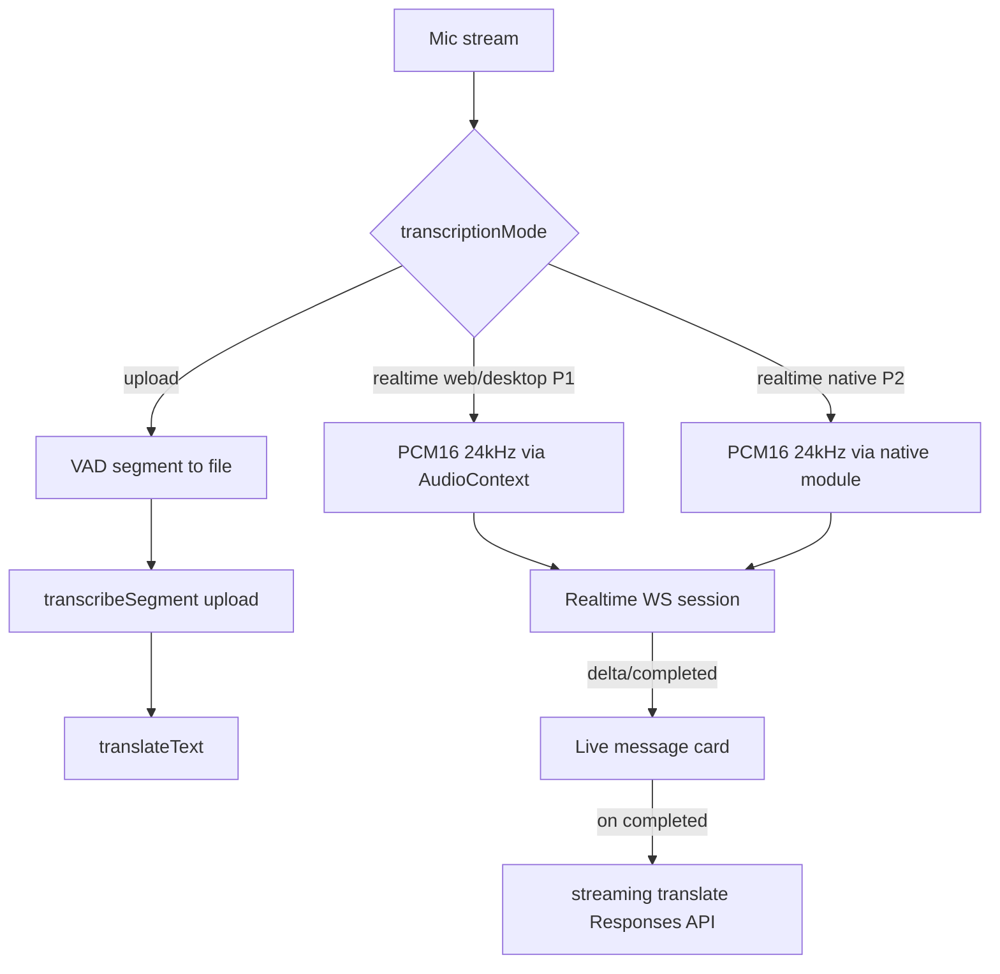

# OpenAI Realtime Transcription & Streaming Translation

## Goal

Add an OpenAI **Realtime** path that streams transcription (and translation) deltas live, while
keeping the existing **record → upload → transcribe** path fully intact. The user picks the mode
manually in settings. When Realtime is selected, the default transcription model becomes
`gpt-realtime-whisper`.

Reference: https://platform.openai.com/docs/guides/realtime-transcription

---

## Phased Delivery

### Phase 1 — Web / Desktop Realtime (this PR)
- WebSocket transcription session on web & Electron desktop.
- Streaming translation via Responses API.
- Native falls back to upload mode automatically.

### Phase 2 — Native Realtime Streaming (follow-up PR)
- A Config Plugin + native Swift/Kotlin module that captures live PCM16 frames from the microphone
  on iOS / Android and bridges them to JS.
- Enables true realtime transcription on mobile with no UI changes (same toggle from Phase 1).
- Requires an **EAS Development Build** (cannot run in Expo Go).

---

## Approach Summary

- Introduce a user-set `transcriptionMode: 'upload' | 'realtime'` (default `'upload'`). This is the
  manual toggle the user asked for. It is **independent** of the existing engine selection.
- Realtime is **OpenAI-only**. Other engines (Gemini, Qwen, Soniox, Doubao, GLM) always use upload
  mode regardless of the toggle.
- Transcription stream: a persistent WebSocket transcription session (`gpt-realtime-whisper`) that
  emits `conversation.item.input_audio_transcription.delta` / `.completed` events.
- Translation stream: when a transcript segment completes, run a **streaming** translation via the
  Responses API (`stream: true`) so translated text also appears incrementally. This reuses the
  existing translation engine/model/prompt settings and works on every platform.
- The existing upload pipeline (`transcribeSegment` / `translateText`) is **untouched** and remains
  the path for upload mode and all non-OpenAI engines.

### Platform support

Realtime needs raw PCM16 audio streamed over a WebSocket.

| Platform | Phase 1 | Phase 2 | Audio source |
|----------|---------|---------|-------------|
| Web | ✅ Realtime | — | `getUserMedia` + `AudioContext` → PCM16 @ 24 kHz |
| Electron desktop | ✅ Realtime | — | Same Web Audio path; reuses existing `MediaStream` |
| iOS (native) | Falls back to upload | ✅ Realtime | Native `AudioEngine` (AVFoundation) → PCM16 tap |
| Android (native) | Falls back to upload | ✅ Realtime | Native `AudioRecord` → PCM16 tap |

In Phase 1, when `transcriptionMode === 'realtime'` on native, the app **falls back to upload mode**
and shows a one-time notice in settings. The toggle stays visible everywhere so behavior is
predictable, and native gets the feature in Phase 2 without UI changes.

Browser/desktop WebSocket auth uses subprotocols
(`["realtime", "openai-insecure-api-key." + apiKey]`), consistent with the app's existing model of
storing and using the user's OpenAI key locally.

---

## Architecture



---

## Phase 1 — Web / Desktop Implementation

### 1. `types/settings.ts`

- Add `export type TranscriptionMode = 'upload' | 'realtime';`
- Add `transcriptionMode: TranscriptionMode` to `TranscriptionSettings` (default `'upload'`).
- Add credential fields to `EngineCredentials`:
  - `openaiRealtimeTranscriptionModel?: string` (default `gpt-realtime-whisper`)
  - `openaiRealtimeDelay?: 'minimal' | 'low' | 'medium' | 'high' | 'xhigh'` (default `low`)
- Add constants: `DEFAULT_OPENAI_REALTIME_TRANSCRIPTION_MODEL = 'gpt-realtime-whisper'`,
  `DEFAULT_OPENAI_REALTIME_DELAY = 'low'`, and a `OPENAI_REALTIME_DELAY_OPTIONS` array.
- Wire defaults into `defaultSettings` (`transcriptionMode: 'upload'` and the two credential
  defaults).

### 2. `services/realtime.ts` (new)

A platform-aware Realtime transcription session, used only on web/desktop.

```typescript
export function isRealtimeSupported(): boolean;
// → true on web/Electron with `WebSocket` + `getUserMedia`.

export function resolveRealtimeTranscriptionModel(settings: AppSettings): string;
// → mirrors resolveTranscriptionModel but for realtime model.

export function resolveRealtimeDelay(settings: AppSettings): string;
// → returns the delay setting or 'low' default.

export interface RealtimeCallbacks {
  onDelta(itemId: string, text: string): void;
  onCompleted(itemId: string, transcript: string): void;
  onError(error: Error): void;
  onOpen(): void;
  onClose(): void;
}

export class RealtimeTranscriptionSession {
  constructor(settings: AppSettings, callbacks: RealtimeCallbacks);
  connect(): Promise<void>;
  // → Opens WS to `wss://api.openai.com/v1/realtime?intent=transcription`
  //   with subprotocols `["realtime", "openai-insecure-api-key." + apiKey]`.
  //   Sends `session.update`:
  //     { type: 'transcription',
  //       audio: { input: { format: { type: 'audio/pcm', rate: 24000 },
  //                          transcription: { model, language?, delay? },
  //                          turn_detection: null } } }

  appendAudio(pcm16Base64: string): void;
  // → `input_audio_buffer.append`

  commit(): void;
  // → `input_audio_buffer.commit` (called on VAD silence boundary).

  close(): void;
  // → Graceful teardown (clears buffers, sends `session.close` if available, closes WS).
}
```

Internally:
- Tracks `item_id` → accumulated text map to reconcile out-of-order completions.
- Parses `conversation.item.input_audio_transcription.delta/.completed` events.
- Handles `error` events from the server → routes to `onError`.

### 3. `services/realtime-audio.web.ts` (new) + `services/realtime-audio.native.ts` (new stub)

Platform-split PCM capture so native builds don't pull Web Audio code.

**Web/desktop** (`realtime-audio.web.ts`):
```typescript
export function createPcmCapture(
  stream: MediaStream,
  onChunk: (pcm16Base64: string) => void
): { stop: () => void };
```
- Creates an `AudioContext` at 24 kHz sample rate.
- Uses `AudioWorkletNode` (preferred) with a fallback to `ScriptProcessorNode`.
- Converts Float32 → PCM16 (reuses the conversion math already in `transcription-context.tsx`
  `encodeWavFromAudioBuffer`, specifically the `clamped < 0 ? clamped * 0x8000 : clamped * 0x7fff`
  pattern).
- Emits base64 PCM16 chunks at ~50–100 ms intervals (1200–2400 samples per chunk).
- The worklet file is a small inline blob (avoids needing a separate public asset).

**Native stub** (`realtime-audio.native.ts`):
```typescript
export function createPcmCapture(): { stop: () => void } {
  throw new Error('Realtime audio capture is not supported on native in Phase 1');
}
```
The context never calls this because it falls back to upload on native.

#### Platform file resolution

Metro resolves `.web.ts` on web/Electron and `.native.ts` on iOS/Android automatically. Both files
export the same `createPcmCapture` signature.

### 4. `services/transcription.ts`

- Re-export the new realtime defaults/helpers for the settings UI.
- Add `translateTextStream(text, settings, { onDelta, signal })` — a streaming variant of
  `translateWithOpenAI` using `stream: true` on `/v1/responses`, parsing SSE
  `response.output_text.delta` events. Falls back to non-streaming `translateText` for
  Gemini/`none`. Returns the final text. `translateText` stays unchanged.

```typescript
export async function translateTextStream(
  text: string,
  settings: AppSettings,
  callbacks: { onDelta: (delta: string) => void; signal?: AbortSignal }
): Promise<TranslationResult>;
```

Implementation detail:
- Uses the same `/v1/responses` endpoint, same model resolution, same prompt construction as
  `translateWithOpenAI`.
- Adds `stream: true` to the payload.
- Reads the response body as a `ReadableStream`, parses SSE `data:` lines.
- Captures `response.output_text.delta` events → calls `onDelta(delta)`.
- Collects the full text and returns `{ text }` on `response.completed`.
- Falls back to `translateText()` if `translationEngine !== 'openai'` (Gemini streaming can be
  added later).

- Add `resolveEffectiveTranscriptionMode(settings)`:
```typescript
export function resolveEffectiveTranscriptionMode(settings: AppSettings): TranscriptionMode {
  if (Platform.OS !== 'web') return 'upload';        // Phase 1: native always upload
  if (settings.transcriptionEngine !== 'openai') return 'upload';
  return settings.transcriptionMode;
}
```
This function becomes the **single switch point** — Phase 2 changes it to check for native module
availability instead of unconditionally returning `'upload'`.

### 5. `contexts/transcription-context.tsx`

- Import `resolveEffectiveTranscriptionMode` and call it on session start.
- **Upload mode**: unchanged — same `finalizeSegment` flow.
- **Realtime mode (web/desktop)**:

  On `startSession`:
  1. Call `getUserMedia({ audio: true })` to get a `MediaStream` (reuse the existing desktop
     `preferredDesktopAudioInputId` override).
  2. Start the existing RMS metering loop on the same stream (for VAD boundary detection).
  3. Create `RealtimeTranscriptionSession` → `connect()`.
  4. Create `createPcmCapture(stream, (chunk) => session.appendAudio(chunk))`.
  5. Set `sessionState = 'recording'`.

  On RMS silence boundary (existing `handleStatusUpdate` logic):
  - Call `session.commit()` instead of the upload `finalizeSegment`.
  - The commit triggers server-side transcription → delta/completed events.

  Event handling (`onDelta(itemId, text)`):
  - If no message exists for `itemId`, allocate a new `TranscriptionMessage` (status `'transcribing'`).
  - Append delta text to `message.transcript` live.

  Event handling (`onCompleted(itemId, transcript)`):
  - Set `message.status = 'completed'`, `message.transcript = transcript`.
  - If translation enabled, call `translateTextStream(transcript, settings, { onDelta })`:
    - Set `translationStatus = 'pending'`.
    - `onDelta`: append to `message.translation` live.
    - On done: `translationStatus = 'completed'`.
    - On error: `translationStatus = 'failed'`.

  On `stopSession`:
  1. Flush a final `session.commit()`.
  2. Wait up to 2 seconds for trailing `completed` events (configurable).
  3. `session.close()`.
  4. Stop PCM capture.
  5. Stop metering stream.
  6. Clean up pending tasks (abort translation streams in flight).

  Reuse existing patterns:
  - `pendingTaskRegistryRef` for tracking/aborting translation streams.
  - `sessionIdRef` / `isTaskCurrent` for session-switch safety.
  - `updateMessage` for all message mutations.
  - No new message statuses needed — `transcribing` + incremental `transcript` works for partial
    text; `translationStatus: 'pending'` + incremental `translation` works for partial translation.

### 6. `app/(tabs)/settings/transcription.tsx`

- Add a **mode toggle** at the top of the `ScrollView`, above `SettingsModelProviderStrip`:
  - Two-option horizontal selector using `OptionPill` (already exists in `settings-form.tsx`):
    "Upload" vs "Realtime".
  - Wired to `updateSettings({ transcriptionMode })`.
- When mode = `realtime` AND active engine = `openai`, show below the detail card:
  - Realtime model `Select` (default `gpt-realtime-whisper`).
  - Delay `Select` (`minimal/low/medium/high/xhigh`).
  - Use `SettingsModelSelectField` pattern.
- When realtime is selected but engine isn't OpenAI, show a muted `Text` hint:
  "Realtime requires the OpenAI engine."
- On native, show a notice card:
  "Realtime streaming is not available on this device yet. Using upload mode."
- Follow existing card/select patterns from `SettingsModelDetailCard`.

### 7. i18n — `src/locales/{en,es,ja,ko,zh-Hans,zh-Hant}/common.json`

Add keys under `settings.transcription`:
```json
{
  "mode": {
    "title": "Transcription Mode",
    "upload": "Upload",
    "realtime": "Realtime",
    "upload_hint": "Record segments, then transcribe",
    "realtime_hint": "Stream audio for live transcription",
    "realtime_requires_openai": "Realtime requires the OpenAI engine.",
    "native_fallback_notice": "Realtime streaming is not available on this device yet. Using upload mode."
  },
  "labels": {
    "realtime_model": "Realtime Model",
    "realtime_delay": "Latency",
    "delay_minimal": "Minimal",
    "delay_low": "Low",
    "delay_medium": "Medium",
    "delay_high": "High",
    "delay_xhigh": "Extra High"
  }
}
```
Run `bun run check:i18n` to confirm parity across all six locales.

---

## Phase 2 — Native Realtime Streaming

### Goal

Bring realtime transcription to iOS and Android by adding a native module that captures live PCM16
audio frames from the microphone and bridges them to JavaScript, where the same
`RealtimeTranscriptionSession` (from Phase 1) consumes them.

### Why a native module?

`expo-audio`'s `useAudioRecorder` only supports recording to a file (no live frame callbacks). The
`AudioPlayer` side exposes data via `AudioWorklet`, but that's playback-only. There is no existing
React Native / Expo library that streams raw PCM16 mic frames to JS in real time.

**Solution:** A lightweight Config Plugin that injects a Swift module (iOS) and a Kotlin module
(Android) into the native project. These modules:
1. Open the microphone at 24 kHz mono PCM16.
2. Emit frame callbacks to JS via `DeviceEventManager` (Android) / `RCTEventEmitter` (iOS).
3. Expose `start`/`stop` methods via a TurboModule (or legacy bridge module for compatibility).

### 2.1 Config Plugin — `plugins/with-realtime-audio.js` (new)

```javascript
const { withDangerousMod, withXcodeProject, withGradleProperties } = require('expo/config-plugins');

function withRealtimeAudio(config) {
  // iOS: add Swift source files + framework dependencies
  config = withXcodeProject(config, (config) => {
    // Add RealtimeAudioModule.swift to the project
    // Link AVFoundation framework
    return config;
  });

  // Android: add Kotlin source files + permissions
  config = withDangerousMod(config, [
    'android',
    async (config) => {
      // Copy RealtimeAudioModule.kt into android/app/src/main/java/...
      return config;
    },
  ]);

  return config;
}

module.exports = withRealtimeAudio;
```

Register in `app.json`:
```json
"plugins": [
  ...,
  ["./plugins/with-realtime-audio", {}]
]
```

### 2.2 iOS Native Module — `plugins/native/ios/RealtimeAudioModule.swift` (new)

```swift
import AVFoundation
import React

// Captures PCM16 @ 24 kHz mono via AVAudioEngine.
// Installs a tap on the input node and emits base64 chunks to JS.
//
// JS API:
//   RealtimeAudioModule.start() → Promise<void>
//   RealtimeAudioModule.stop() → Promise<void>
//
// Events:
//   "realtimeAudioFrame" → { chunk: "<base64 PCM16>" }
//
// Configuration:
//   - Sample rate: 24000 Hz
//   - Channels: 1 (mono)
//   - Format: PCM Int16
//   - Chunk interval: ~50ms (1200 samples)
//
// Lifecycle:
//   - start(): requests permission, creates AVAudioEngine,
//     installs tap on inputNode, starts engine.
//   - stop(): removes tap, stops engine, releases resources.
//   - Handles audio session interruption (phone call, etc.) gracefully.
//
// Error handling:
//   - Permission denied → reject promise with descriptive error.
//   - Engine start failure → reject with underlying AVAudioEngine error.
```

Key implementation points:
- Uses `AVAudioEngine` with `inputNode.installTap(onBus: 0, bufferSize: 1200, format: ...)`.
- Converts `AVAudioPCMBuffer` → `[Int16]` → base64 string.
- Emits via `sendEvent(withName: "realtimeAudioFrame", body: ["chunk": base64])`.
- Configures `AVAudioSession` with `.playAndRecord` category, `.voiceChat` mode for 24 kHz.
- Thread safety: all audio operations on the audio queue thread; event emission is safe to call
  from any thread (RCTEventEmitter handles marshalling).

### 2.3 Android Native Module — `plugins/native/android/RealtimeAudioModule.kt` (new)

```kotlin
import android.media.AudioFormat
import android.media.AudioRecord
import android.media.MediaRecorder
import com.facebook.react.bridge.*
import com.facebook.react.modules.core.DeviceEventManagerModule
import java.util.concurrent.atomic.AtomicBoolean

// Captures PCM16 @ 24 kHz mono via AudioRecord.
//
// JS API (same as iOS):
//   RealtimeAudioModule.start() → Promise<void>
//   RealtimeAudioModule.stop() → Promise<void>
//
// Events:
//   "realtimeAudioFrame" → { chunk: "<base64 PCM16>" }
//
// Configuration:
//   - Sample rate: 24000 Hz
//   - Channels: CHANNEL_IN_MONO
//   - Encoding: ENCODING_PCM_16BIT
//   - Buffer size: max(AudioRecord.getMinBufferSize(...), 2400 * 2)
//   - Read interval: ~50ms (1200 samples per read)
//
// Lifecycle:
//   - start(): checks RECORD_AUDIO permission, creates AudioRecord,
//     spawns a reading thread that loops AudioRecord.read().
//   - stop(): signals thread to stop via AtomicBoolean, releases AudioRecord.
//
// Thread safety:
//   - Audio reading happens on a dedicated HandlerThread.
//   - Event emission via RCTDeviceEventEmitter (thread-safe).
```

Key implementation points:
- Uses `AudioRecord` with `MediaRecorder.AudioSource.VOICE_RECOGNITION` for best STT quality.
- Reading loop runs on a background `HandlerThread`, reads 1200 samples (2400 bytes) per iteration.
- Converts `ShortArray` → base64 via `android.util.Base64`.
- Emits via `reactApplicationContext.getJSModule(DeviceEventManagerModule.RCTDeviceEventEmitter::class.java).emit(...)`.
- Handles `AudioRecord` state errors (uninitialized, invalid state) and rejects promise.

### 2.4 JS Bridge — `services/realtime-audio.native.ts` (replace Phase 1 stub)

```typescript
import { NativeModules, NativeEventEmitter, Platform } from 'react-native';

const { RealtimeAudioModule } = NativeModules;
const emitter = RealtimeAudioModule ? new NativeEventEmitter(RealtimeAudioModule) : null;

export function isNativeRealtimeAvailable(): boolean {
  return Platform.OS !== 'web' && RealtimeAudioModule != null;
}

export function createPcmCapture(
  _stream: MediaStream | null,
  onChunk: (pcm16Base64: string) => void
): { stop: () => void } {
  if (!RealtimeAudioModule || !emitter) {
    throw new Error('RealtimeAudioModule is not available. Ensure you are using a dev build.');
  }

  const subscription = emitter.addListener('realtimeAudioFrame', (event: { chunk: string }) => {
    onChunk(event.chunk);
  });

  RealtimeAudioModule.start();

  return {
    stop: () => {
      subscription.remove();
      RealtimeAudioModule.stop().catch(() => undefined);
    },
  };
}
```

### 2.5 TypeScript declarations — `types/realtime-audio.d.ts` (new)

```typescript
declare module 'realtime-audio-native' {
  export interface RealtimeAudioNativeModule {
    start(): Promise<void>;
    stop(): Promise<void>;
  }
  export const RealtimeAudioModule: RealtimeAudioNativeModule | null;
}
```

Or use `NativeModules` augmentation in an existing `.d.ts`:
```typescript
import type { ReactNativeModule } from 'react-native';

declare module 'react-native' {
  interface NativeModulesStatic {
    RealtimeAudioModule?: {
      start(): Promise<void>;
      stop(): Promise<void>;
    };
  }
}
```

### 2.6 Update `services/transcription.ts` — `resolveEffectiveTranscriptionMode`

```typescript
import { isNativeRealtimeAvailable } from '@/services/realtime-audio.native';

export function resolveEffectiveTranscriptionMode(settings: AppSettings): TranscriptionMode {
  if (settings.transcriptionEngine !== 'openai') return 'upload';
  if (Platform.OS === 'web') return settings.transcriptionMode;
  // Phase 2: check for native module availability
  if (isNativeRealtimeAvailable()) return settings.transcriptionMode;
  return 'upload'; // fallback
}
```

### 2.7 Update `contexts/transcription-context.tsx`

The realtime branch already uses `createPcmCapture()` which resolves to `.native.ts` on native.
The only change: remove the native fallback guard since `resolveEffectiveTranscriptionMode` now
returns `'realtime'` on native when the module is available.

The existing `getUserMedia` call on web remains web-only. On native, `createPcmCapture` receives
`null` for the stream parameter and uses the native module instead.

### 2.8 Update settings notice — `app/(tabs)/settings/transcription.tsx`

```typescript
// Phase 1: always show "falls back to upload" on native.
// Phase 2: only show if native module is NOT available.
const showNativeFallbackNotice =
  Platform.OS !== 'web' && !isNativeRealtimeAvailable();
```

### 2.9 EAS Development Build

Phase 2 requires a **Development Build** because it adds native code outside Expo Go.

```bash
# Install EAS CLI (if not already)
npm install -g eas-cli

# Create development build
eas build --profile development --platform ios
eas build --profile development --platform android

# Or local build (faster iteration):
eas build --profile development --platform ios --local
```

Add to `eas.json`:
```json
{
  "profiles": {
    "development": {
      "developmentClient": true,
      "distribution": "internal"
    }
  }
}
```

The Config Plugin runs during prebuild (`npx expo prebuild`), injecting the native source files into
the generated `ios/` and `android/` directories.

### 2.10 Build verification

- `npx expo prebuild --clean` (verify plugin runs without errors)
- `eas build --profile development --platform ios --local` (verify iOS compiles)
- `eas build --profile development --platform android --local` (verify Android compiles)
- Manual: realtime session on a physical device shows live transcript deltas.

---

## Verification

### Phase 1
- `bun run lint`
- `bunx tsc --noEmit --pretty false`
- `bun run check:i18n`
- `git diff --check`
- Manual (desktop/web): realtime session shows live transcript deltas and streaming translation.
- Manual: upload mode unchanged.
- Manual: native realtime falls back to upload cleanly.

### Phase 2
- All Phase 1 checks still pass.
- `npx expo prebuild --clean` succeeds.
- iOS dev build compiles and installs.
- Android dev build compiles and installs.
- Manual (physical iOS device): realtime transcription streams live.
- Manual (physical Android device): realtime transcription streams live.
- Manual: fallback to upload still works when module is unavailable (Expo Go).

---

## File Summary

| Phase | File | Action |
|-------|------|--------|
| P1 | `types/settings.ts` | Edit — add types, constants, defaults |
| P1 | `services/realtime.ts` | New — WebSocket transcription session |
| P1 | `services/realtime-audio.web.ts` | New — AudioWorklet PCM capture |
| P1 | `services/realtime-audio.native.ts` | New — stub (throws) |
| P1 | `services/transcription.ts` | Edit — add `translateTextStream`, `resolveEffectiveTranscriptionMode`, re-exports |
| P1 | `contexts/transcription-context.tsx` | Edit — add realtime session lifecycle |
| P1 | `app/(tabs)/settings/transcription.tsx` | Edit — mode toggle + realtime options |
| P1 | `src/locales/*/common.json` (×6) | Edit — new i18n keys |
| P2 | `plugins/with-realtime-audio.js` | New — Config Plugin |
| P2 | `plugins/native/ios/RealtimeAudioModule.swift` | New — iOS native module |
| P2 | `plugins/native/ios/RealtimeAudioModule.mm` | New — ObjC++ bridge |
| P2 | `plugins/native/android/RealtimeAudioModule.kt` | New — Android native module |
| P2 | `services/realtime-audio.native.ts` | Replace stub with native bridge |
| P2 | `services/transcription.ts` | Edit — update `resolveEffectiveTranscriptionMode` |
| P2 | `types/realtime-audio.d.ts` | New — TS declarations |
| P2 | `app.json` | Edit — register Config Plugin |
| P2 | `eas.json` | Edit — add development build profile |
| P2 | `contexts/transcription-context.tsx` | Minor edit — remove native fallback guard |

---

## Open Decisions (defaults chosen, change on request)

1. **Translation streaming via Responses API** (chosen) rather than the dedicated
   `/v1/realtime/translations` audio-interpreter endpoint. The Responses path reuses existing
   translation settings, streams text, and works on all platforms. The dedicated translation
   session is audio-to-audio interpretation and a much larger change; can be a future option.

2. **Native realtime via Config Plugin + native module** (chosen for Phase 2) rather than waiting
   for `expo-audio` to add live frame support. The Config Plugin approach is self-contained and
   doesn't depend on upstream Expo roadmap.

3. **AudioWorklet over ScriptProcessorNode** (chosen) for better performance and deprecation
   safety. ScriptProcessorNode is the fallback for older browsers.

4. **Manual commit driven by existing VAD** so realtime keeps the current "one card per utterance"
   UX. Alternative: server VAD (not used for `gpt-realtime-whisper` per docs).

5. **Phase 2 native module uses base64 transport** (chosen) for simplicity and compatibility with
   the WebSocket API (which already uses base64 for `input_audio_buffer.append`). Alternative: a
   binary WebSocket bridge would be more efficient but adds significant complexity for a ~2×
   bandwidth saving at 24 kHz mono.
